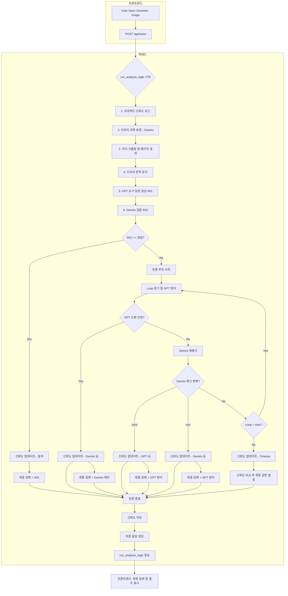

GemPT API 명세서 (API Specification)

1. 프로젝트명
   GemPT: AI 기반 교차 검증 시스템

2. 배경
   본 문서는 GemPT 시스템의 백엔드 API 엔드포인트를 설명합니다. 이 API는 AI 기반 문제 해결, 교차 검증, 그리고 AI 모델 간의 토론 과정을 지원합니다.

3. 기본 URL (개발 환경)
   http://127.0.0.1:5000

---

5. API 엔드포인트 상세

   5.1. 프론트엔드 HTML 페이지 제공

      5.1.1. 엔드포인트
            /

      5.1.2. 메서드
            GET

      5.1.3. 설명
            웹 애플리케이션의 메인 프론트엔드 HTML 페이지를 제공합니다. 사용자가 브라우저를 통해 애플리케이션에 접속할 때 사용됩니다.

      5.1.4. 요청 파라미터
            없음

      5.1.5. 응답
            Content-Type: text/html
            바디: frontend/index.html 파일의 HTML 내용

   5.2. 문제 제출 및 AI 솔루션 요청

      5.2.1. 엔드포인트
            /api/solve

      5.2.2. 메서드
            POST

      5.2.3. 설명
            사용자가 문제 이미지와 질문을 제출하면, AI 시스템이 다음 과정을 거쳐 최종 솔루션과 함께 업데이트된 신뢰도 점수를 반환합니다:
            1) 이미지 과목 인식 및 사전 정보 크롤링
            2) 다국어 번역 AI 로직 처리
            3) GPT와 Gemini 간의 문제 해결, 검증 및 토론
            이 모든 과정은 제출된 project_id에 따라 기록되고 점수에 반영됩니다.

      5.2.4. 요청 바디 (Form Data - multipart/form-data)
            image: File (필수) - 문제 내용을 담은 이미지 파일.
            question: String (선택 사항) - 문제에 대한 사용자의 질문 또는 프롬프트. 제공되지 않을 경우 기본값은 'Please solve the problem in the image.' 입니다.
            project_id: String (선택 사항) - 문제가 속한 프로젝트의 고유 ID. 신뢰도 점수 영속성 관리에 사용됩니다. 제공되지 않을 경우 기본값은 백엔드에 정의된 PROJECT_ID (예: "team_hackathon_demo")입니다.

      5.2.5. 응답 바디 (JSON)
            winner: String - 토론에서 승리한 AI ("GPT", "Gemini"), 합의된 경우 ("Draw (Agreement)"), 또는 제한 시간을 초과한 경우 ("Draw (Timeout)")를 나타냅니다.
            final_answer: String - AI 시스템이 검증을 거쳐 제공하는 최종 해결책. LaTeX 형식의 수학 표현식이 포함될 수 있습니다.
            scores: Object - 해당 프로젝트에 대한 GPT 및 Gemini의 현재 신뢰도 점수.
              GPT: Integer - GPT의 현재 신뢰도 점수.
              Gemini: Integer - Gemini의 현재 신뢰도 점수.
            process: Array of Objects - AI 토론 과정의 상세 로그 배열.
              model: String - 메시지를 생성한 AI 또는 시스템 ("GPT", "Gemini", "System").
              content: String - AI의 메시지 내용 또는 시스템 업데이트 메시지.
              step: String - 해당 과정의 단계 설명 (예: "주제 분류", "초기 해결책", "검증", "라운드 1 방어").

      5.2.6. 에러 응답
            400 Bad Request: {"error": "No image file provided"} 또는 {"error": "No selected file"}
            500 Internal Server Error: {"error": "An unexpected error occurred."}

   5.3. 프로젝트별 신뢰도 점수 조회

      5.3.1. 엔드포인트
            /api/scores/<project_id>

      5.3.2. 메서드
            GET

      5.3.3. 설명
            지정된 project_id에 해당하는 프로젝트의 현재 GPT 및 Gemini 신뢰도 점수를 조회합니다.

      5.3.4. URL 파라미터
            <project_id>: String (필수) - 점수를 조회할 프로젝트의 고유 식별자.

      5.3.5. 응답 바디 (JSON)
            GPT: Integer - 해당 프로젝트에 대한 GPT의 현재 신뢰도 점수.
            Gemini: Integer - Gemini의 현재 신뢰도 점수.

      5.3.6. 특이사항
            project_id에 해당하는 점수가 project_db.json 파일에 없을 경우, 기본값인 {"GPT": 0, "Gemini": 0}을 반환합니다. 이는 오류로 처리되지 않습니다.

---

6. API 상세 흐름도

   본 섹션은 /api/solve 엔드포인트 호출 시 발생하는 AI 시스템의 상세 처리 흐름을 설명합니다.


```
7. 신뢰도 점수 산정 방식

   Gemini와 GPT의 신뢰도 점수는 토론 루프(Loop)의 결과에 따라 동적으로 산정됩니다. 'Loop'는 토론 라운드를 의미하며, 값이 1부터 시작합니다.

   *   Gemini 승리 (GPT가 오류를 인정하거나 Gemini의 수정에 동의):
       Gemini 점수 증가량 = (2^(2 * Loop - 1)) - 1
       (예: Loop=1일 때 (2^1)-1 = 1점, Loop=2일 때 (2^3)-1 = 7점)

   *   GPT 승리 (Gemini가 GPT의 반박에 설득):
       GPT 점수 증가량 = (2^(2 * Loop)) - 1
       (예: Loop=1일 때 (2^2)-1 = 3점, Loop=2일 때 (2^4)-1 = 15점)

   이러한 방식으로 토론 루프가 길어질수록 승리 모델이 얻는 점수가 기하급수적으로 증가하여, 더 빠르고 정확한 합의 도출을 장려합니다.
